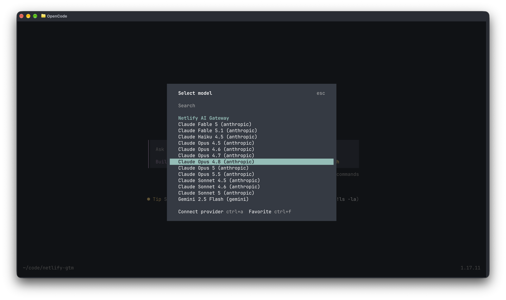

# netlify-ai-opencode

Use Netlify's [AI Gateway](https://docs.netlify.com/build/ai-gateway/overview/) as the model
backend for [OpenCode](https://opencode.ai), or for any tool that speaks the Anthropic, OpenAI or
Gemini API. Claude, GPT, Gemini and about 170 OpenRouter-routed models (DeepSeek, Qwen, Kimi, GLM,
Grok, Llama, Mistral) behind one Netlify site and one key you control. No provider accounts.

[](https://app.netlify.com/start/deploy?repository=https://github.com/bridgpal/netlify-ai-opencode)



## How it works

The AI Gateway is only reachable from code running on Netlify. Functions and Edge Functions
receive a short-lived key and a base URL at request time, and nothing else can get them. This
repo deploys a small Edge Function that stands in front of the gateway:

```
OpenCode ──(your relay key)──▶ https://your-site.netlify.app/anthropic/v1/messages
                                   │ relay.ts: check key, swap in the gateway credential, stream back
                                   ▼
                               Netlify AI Gateway ──▶ Anthropic / OpenAI / Gemini / OpenRouter
```

Usage is billed to your Netlify team in credits, exactly as if you had called the gateway from
your own site. The gateway credential never leaves Netlify; clients only ever hold a relay key
that you mint and can revoke.

Two pieces live here:

- `netlify/` the relay: `/anthropic/*`, `/openai/*`, `/gemini/*`, `/openrouter/*`, plus `/models` and `/whoami`.
- `plugin/` an OpenCode v2 plugin, loaded locally from this clone (not published to npm), which registers a `netlify-ai` provider listing every model the relay offers.

## 1. Deploy the relay

You need a Netlify team on a credit-based plan (Free, Personal or Pro have the gateway on by
default; Enterprise teams ask their account manager to enable it).

1. Generate a key. The part before the colon is a label that shows up in the usage ledger.

   ```
   openssl rand -hex 32 | sed 's/^/alice:/'
   ```

2. Click the Deploy to Netlify button above. When asked, paste the key into `RELAY_KEYS`. Leave
   the other two variables empty unless you want a model allowlist or a daily token budget.

3. Wait for the first production deploy to finish (the gateway activates on the first production
   deploy), then check:

   ```
   curl -H "Authorization: Bearer <secret part of your key>" https://YOUR-SITE.netlify.app/whoami
   ```

   You should see your key label and an empty usage record for today.

Deploying from the CLI instead:

```
git clone https://github.com/bridgpal/netlify-ai-opencode && cd netlify-ai-opencode
npm install
netlify sites:create --name my-ai-relay
netlify env:set RELAY_KEYS "alice:$(openssl rand -hex 32)" --secret --context production --context deploy-preview --context branch-deploy
netlify deploy --prod --no-build --dir public
```

Mark `RELAY_KEYS` as a secret in the Netlify UI if you set it there, and set it before the deploy
(environment changes need a redeploy to take effect).

## 2. Use it from OpenCode

Requires OpenCode v2 (`opencode --version` prints `2.x`). The plugin is not on npm; OpenCode loads
it from a directory on disk, so clone this repo somewhere permanent. The built plugin is committed,
so there is nothing to install or compile.

```
git clone https://github.com/bridgpal/netlify-ai-opencode ~/netlify-ai-opencode
```

Then add it to `~/.config/opencode/opencode.json` (or a project `opencode.json`), using the
absolute path of the `plugin` directory and your relay URL:

```json
{
  "$schema": "https://opencode.ai/config.json",
  "plugin": [["/Users/you/netlify-ai-opencode/plugin", { "url": "https://YOUR-SITE.netlify.app" }]]
}
```

Give OpenCode the key, either through its credential store:

```
opencode auth login netlify-ai
# paste the secret part of your relay key
```

or through the environment of the shell that starts OpenCode:

```
export NETLIFY_AI_RELAY_KEY=<secret part of your relay key>
```

Then:

```
opencode models | grep netlify-ai      # every model the relay offers
opencode run -m netlify-ai/claude-sonnet-5 "hello"
```

The provider is called `netlify-ai`. Anthropic, OpenAI, Gemini and OpenRouter-routed models all
appear under it (about 290 today), each wired to the right AI SDK package and relay path, so one
key covers everything. OpenRouter ids keep their slash, for example `netlify-ai/qwen/qwen3-coder`.
The list is fetched from the relay's `/models` when the plugin loads and falls back to a small
built-in list if no key is known yet. After connecting a key, run `opencode reload` (or restart)
so the full list is fetched. The relay URL can also come from `NETLIFY_AI_RELAY_URL`.

Plugin options: `url`, `key` (prefer the credential store or env var), and `upstreams`, an array
limiting which of `anthropic`, `openai`, `gemini`, `openrouter` get listed. Pass
`"upstreams": ["anthropic", "openai", "gemini"]` if 170 OpenRouter entries clutter your picker.

To update later: `git pull` in the clone, then restart OpenCode's background service
(`opencode service stop`, or kill the `opencode serve --service` process). The path must point at
the `plugin` directory itself, not at a file inside it.

### Without the plugin

Generate a plain `provider` block from your relay and paste it into `opencode.json`:

```
node scripts/opencode-provider.mjs https://YOUR-SITE.netlify.app <relay-key> > provider.json
node scripts/opencode-provider.mjs https://YOUR-SITE.netlify.app <relay-key> --key-env NETLIFY_AI_RELAY_KEY   # reference an env var instead of embedding the key
```

It writes one `netlify-ai` provider whose models each carry their own `provider.npm` and
`provider.api`. Re-run it when the model list changes. `examples/opencode.manual.json` shows a
hand-written three-provider variant.

## 3. Use it from anything else

The relay is path-transparent: whatever a provider SDK would append to its base URL, the relay
appends to the gateway. Point any official SDK at the matching prefix and pass the relay key as
that SDK's API key.

```
# Anthropic
curl https://YOUR-SITE.netlify.app/anthropic/v1/messages \
  -H "x-api-key: $RELAY_KEY" -H "anthropic-version: 2023-06-01" -H "content-type: application/json" \
  -d '{"model":"claude-haiku-4-5","max_tokens":50,"messages":[{"role":"user","content":"hi"}]}'

# OpenAI (Responses or Chat Completions; OpenRouter model ids such as deepseek/deepseek-v4-flash work here too)
curl https://YOUR-SITE.netlify.app/openai/v1/responses \
  -H "Authorization: Bearer $RELAY_KEY" -H "content-type: application/json" \
  -d '{"model":"gpt-5-mini","input":"hi"}'

# Gemini
curl "https://YOUR-SITE.netlify.app/gemini/v1beta/models/gemini-2.5-flash:generateContent" \
  -H "x-goog-api-key: $RELAY_KEY" -H "content-type: application/json" \
  -d '{"contents":[{"role":"user","parts":[{"text":"hi"}]}]}'
```

`GET /models` returns the combined catalog; `GET /whoami` returns your key label and today's usage.

## Configuration

All settings are environment variables on the Netlify site. Redeploy after changing them.

| Variable | Required | What it does |
| --- | --- | --- |
| `RELAY_KEYS` | yes | Keys clients may present, separated by commas or newlines, each `label:secret` (or just `secret`). Missing means every request gets a 503. |
| `RELAY_MODELS_ALLOW` | no | Comma-separated globs such as `claude-*,gpt-5*`. Requests for other models get a 403 and `/models` hides them. |
| `RELAY_DAILY_TOKEN_BUDGET` | no | Max input plus output tokens per key per UTC day. Over budget returns 429 until midnight UTC. |
| `RELAY_LEDGER` | no | `false` disables the usage ledger entirely (no Blobs reads or writes). Default on. |
| `RELAY_ANTHROPIC_MODELS` | no | Override the Anthropic ids that `/models` advertises. |
| `RELAY_OPENROUTER` | no | `false` hides OpenRouter-routed models from `/models` (they stay callable). Default on. |

Do not set `ANTHROPIC_API_KEY`, `OPENAI_API_KEY`, `GEMINI_API_KEY` or `OPENROUTER_API_KEY` on
this site. Netlify only injects gateway credentials when you have not set your own.

## Safety

- Clients never see gateway or provider credentials, only a relay key you minted.
- Keys are compared by SHA-256 digest in constant time. A missing `RELAY_KEYS` fails closed.
- To revoke a key, remove it from `RELAY_KEYS` and redeploy. Give each person their own label so the ledger tells you who used what.
- A model allowlist and a daily token budget cap what a leaked key can cost.
- Add Netlify [rate limiting rules](https://docs.netlify.com/manage/security/secure-access-to-sites/rate-limiting/) on `/*` if your plan includes them.
- The gateway's own limits still apply per team: 200k input tokens per request and a per-minute credit limit by plan.
- The landing page is `noindex` and carries no secrets. Everything else requires a key.

## Known behavior

- **Streaming arrives in bursts.** The gateway flushes server-sent events in roughly 4 KB blocks rather than per token, so OpenCode shows output in chunks. The relay itself does not buffer.
- **Cost shows as zero in OpenCode.** Spend is billed in Netlify credits; check your team's usage page.
- **Beta headers are dropped.** The gateway does not forward request headers such as `anthropic-beta`, so header-gated experimental features silently do nothing.
- **Anthropic and OpenRouter ids come from Netlify's published model table.** OpenAI and Gemini ids are fetched live from the gateway, which has no list endpoint for the other two, so `/models` reads the [model availability table](https://docs.netlify.com/build/ai-gateway/overview/#model-availability) and caches it for an hour, with a built-in Anthropic fallback.
- **The ledger is approximate.** Rows are written after each response finishes; concurrent requests can race. Netlify's usage page is the billing truth.

## Repo layout

```
netlify/edge-functions/relay.ts    the proxy (auth, allowlist, budget, streaming, ledger tap)
netlify/edge-functions/models.ts   GET /models
netlify/edge-functions/whoami.ts   GET /whoami
netlify/lib/                       auth, providers, usage parsing, ledger (Netlify Blobs)
plugin/                            OpenCode v2 plugin, loaded locally; dist/ is committed so a clone is enough
scripts/opencode-provider.mjs      prints a plain provider block from the relay's /models (no-plugin path)
examples/                          opencode.json snippets, with and without the plugin
docs/design.md                     verified gateway behavior and design decisions
scripts/gen-key.sh                 prints a label:secret pair
```

## Development

```
npm install && npm --prefix plugin install
npm run plugin:build                       # rebuilds plugin/dist/index.js (commit it)
netlify deploy --prod --no-build --dir public --site <site-id>
```

Restart OpenCode's background service after rebuilding the plugin so it picks up the new code.

## License

MIT
